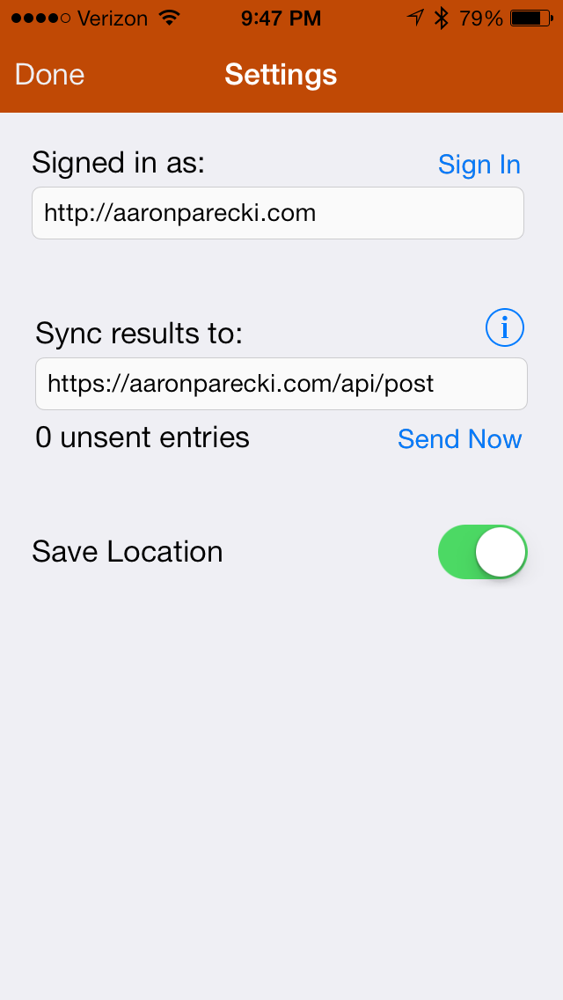

## Pushup Counter

### Setup

`pod install`

`cp PushupCounter/Config.example.h PushupCounter/Config.h`

Edit `Config.h` and define your API endpoint to send to.

`open PushupCounter.xcworkspace`

### Credits

<a href="http://thenounproject.com/noun/exercise/#icon-No14930" target="_blank">Exercise</a> icon designed by <a href="http://thenounproject.com/vleenie" target="_blank">vleenie</a> from The Noun Project

### License

Copyright 2013 by Aaron Parecki

Licensed under the Apache license. See LICENSE.

