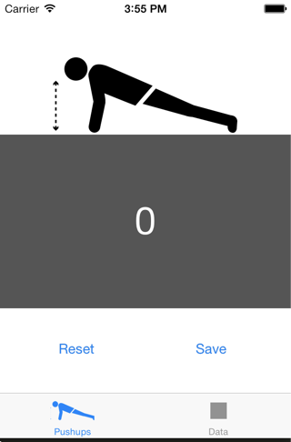

## Pushup Counter

### Setup

`pod install`

`cp PushupCounter/Config.example.h PushupCounter/Config.h`

Edit `Config.h` and define your API endpoint to send to.

`open PushupCounter.xcworkspace`

### License

Copyright 2013 by Aaron Parecki

Licensed under the Apache license. See LICENSE.
