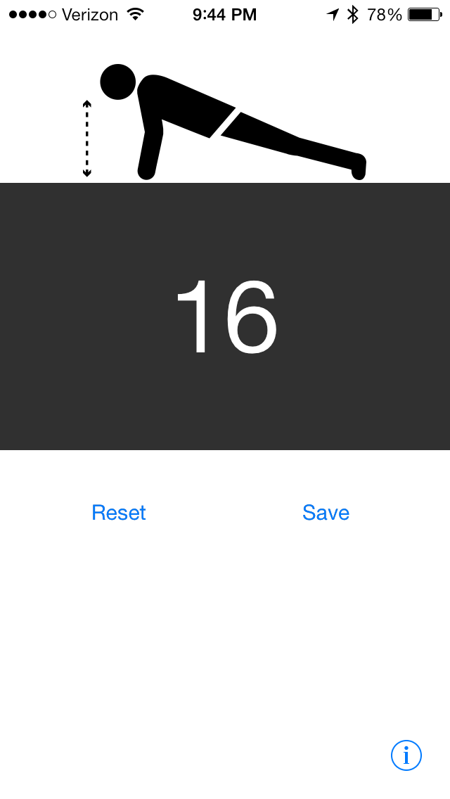

## Pushup Counter

### Setup

`pod install`

`open PushupCounter.xcworkspace`

### Authentication

Authentication is handled via IndieAuth. Until a good tutorial is written, you can find some info on this process [here](https://github.com/indieweb/indieauth-client-php#usage-for-clients).

### Credits

<a href="http://thenounproject.com/noun/exercise/#icon-No14930" target="_blank">Exercise</a> icon designed by <a href="http://thenounproject.com/vleenie" target="_blank">vleenie</a> from The Noun Project

### License

Copyright 2013 by Aaron Parecki

Licensed under the Apache license. See LICENSE.

